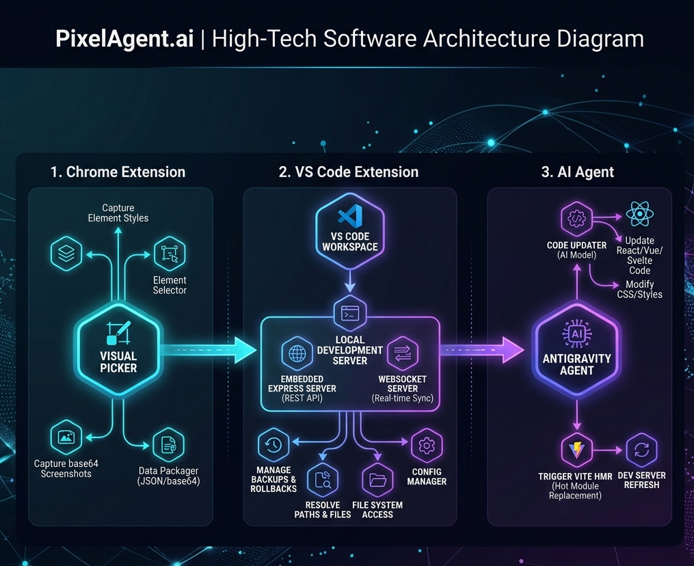
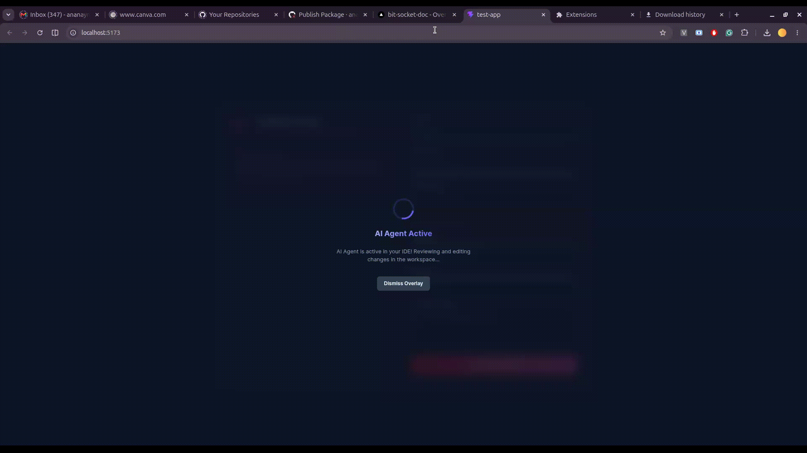

# Pixel-Agent.ai: Browser-to-IDE Visual Repair Agent Loop

Welcome to the **Pixel-Agent.ai** ecosystem. This project enables a continuous, hot-reloaded visual repair loop that bridges the gap between your browser's rendered UI and your local IDE workspace. 

By inspecting elements in the browser, Pixel-Agent captures deep React context, computes CSS properties, takes screenshots, programmatically focuses the exact source file in the IDE, and prompts the AI agent to write the fix—reloading the browser automatically upon save.

---

## 📐 System Architecture

The ecosystem is split into four primary directories:
1. **[Chrome Extension](https://github.com/ananay-nag/pixelagent-ai-chrome-ext-code)**: A browser extension acting as the frontend visual inspector and style modifier.
2. **[IDE Extension](https://github.com/ananay-nag/pixelagent-ai-ide-ext-code)**: A VS Code / Antigravity IDE extension containing the control sidebar panel, a local backup/rollback vault, and the **embedded Local Bridge server** (Express & WebSockets).
3. **[Specifications & Blueprints](https://github.com/ananay-nag/pixelagent-ai-code)**: Global schemas, documentation, and design specifications.
4. **Distributions & Assets** (This Folder): Stores compiled releases (e.g. `.crx` Chrome extensions, `.vsix` IDE extensions) and demo media.

---

## 📺 Demonstration Video

Here is a short demonstration showing the browser-to-IDE visual repair loop in action:

*If the video player above does not load, you can download or play the file directly here: [TRIM_20260628_150156.mp4](TRIM_20260628_150156.mp4)*

---

## 🚀 Key Features & Capabilities

* **React Fiber Metadata Inspector**: Injects a script (`inject.js`) into the web page to extract React component names, filenames, and line numbers (`__source` attributes) for inspected DOM elements.
* **In-Browser Style Editor**: Provides a floating element modifier panel (`#pixelagent-floating-card`) directly in the browser to draft styling changes before committing them.
* **Canvas Screenshot Capturer**: Snippets the active layout bounding boxes and saves visual context to support multimodal prompt injection.
* **Embedded Express & WebSocket Bridge**: Serves an integrated API server from the IDE on port `9559`. Receives visual issues and handles editor orchestration.
* **Tailwind CSS Context Harvesting**: Scans the workspace for custom themes (screens, colors, fonts) and incorporates them into the prompt.
* **Rollback Vault**: Backs up target files as `.bak` prior to edits, holding the last 20 changes for safe one-click restoration.
* **Save Event Watchers**: Listens to IDE workspace saves and transmits reload notifications back to the Chrome extension over WebSocket for hot reloads.

---

## 📦 Installation & Setup Guide

### 1. How to Install the Chrome Extension
You can download and install the Chrome Extension directly:
1. **Download the Extension**: Get the latest files/packages from the [GitHub pixelagent.ai repository](https://github.com/ananay-nag/pixelagent.ai/tree/main).
2. **Open Extensions Page**: In Google Chrome, go to `chrome://extensions/`.
3. **Enable Developer Mode**: Turn on the **Developer mode** toggle in the top-right corner.
4. **Drag & Drop**: Drag the downloaded `pixelagentai-v<x.x.x>.crx` file from your local file manager and drop it anywhere onto the Extensions page to install it.
   *(Alternatively, rename `.crx` to `.zip`, extract it, click **Load unpacked**, and select the extracted folder)*.

---

### 2. How to Install the IDE Extension in Antigravity
You can install the Pixel-Agent.ai extension in your Antigravity IDE using any of these options:

* **Option A: Search in the IDE (Recommended)**
  1. Open your **Antigravity IDE**.
  2. Go to the Extensions panel (`Ctrl+Shift+X` or `Cmd+Shift+X`).
  3. Search for **"Pixel-Agent.ai"** and click **Install**.

* **Option B: Open VSX Registry**
  * Install the extension directly from the [Open VSX Registry Page](https://open-vsx.org/extension/ananaynag-pixelagent-ide-extension/pixelagent-ide-extension).

* **Option C: Manual VSIX Installation**
  1. If you compile the `.vsix` manually from source, run `npx @vscode/vsce package` in the `pixelagent-ai-ide-ext-code` folder.
  2. Open the Extensions sidebar in Antigravity, click the **three dots (`...`)** in the top-right, and select **Install from VSIX...**.
  3. Select the generated `.vsix` file to install.

---

## 🛠 Working Usage Loop

1. **Launch Dev Server**: Start your local web application's dev server (e.g. `npm run dev` for Vite/Next.js/etc.).
2. **Start the Bridge**: In the Antigravity IDE, click the **Pixel-Agent.ai** icon in the sidebar and click **Start Server** (listening on port `9559`).
3. **Inspect Element**: In your browser, click the Chrome Extension icon, hover over any element, and click it.
4. **Draft Fix**: Enter your feedback or desired changes in the floating browser panel and click **Submit**.
5. **Orchestrate & Verify**:
   - The IDE automatically opens the correct file and positions your cursor.
   - The Antigravity AI Agent is invoked with visual/code context.
   - Once the AI applies the fix and saves, the browser reloads instantly!
